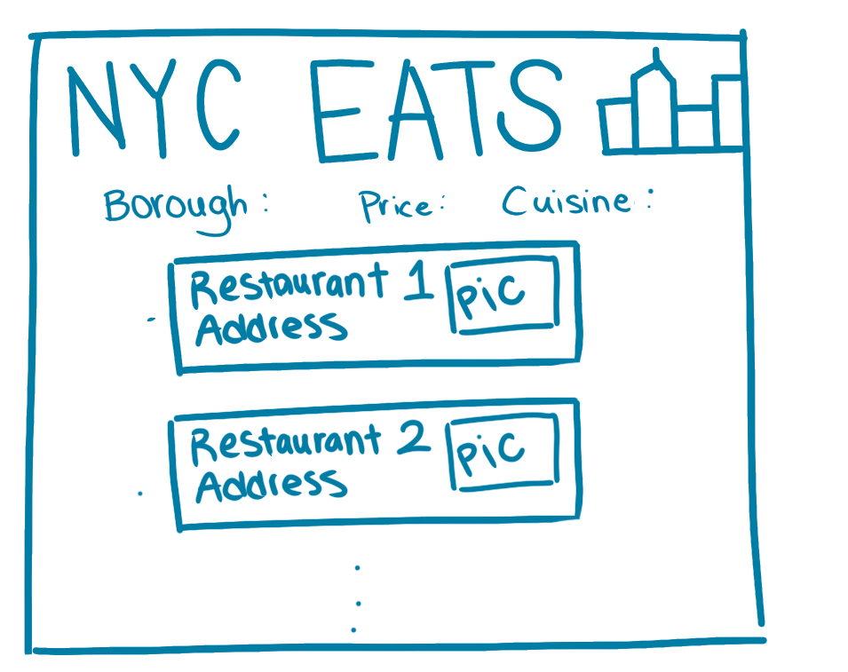
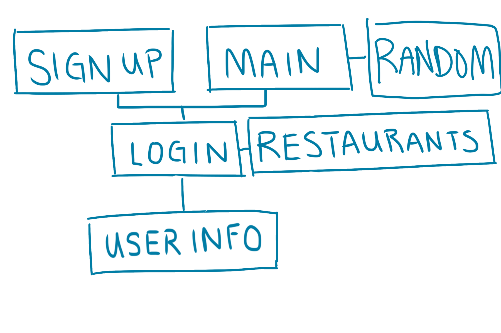

# :ramen: NYC Eats :shaved_ice:

## Overview

Basically, this is a simpler Yelp focused on Asian resturants in NYC. Anyone can search restaurants and results can be filtered by name, cuisine, borough, and price point. Anyone can also choose a random restaurant on the site using a random generator. Anyone can register an account and become a user. Users can login to post reviews check how many reviews for each type of cuisine they have reviewed in chronological order. 

## Data Model

The application will store Users, Resturants and Reviews

* users can have multiple reviews (via references)
* reviews have content, timestamp, and the username of the user who posted it
* each resturant will have name, cuisine, borough, price point, picture, and reviews (by embedding)


An Example User:

```javascript
{
  username: "foodie123",
  hash: // a password hash,
  reviews: // an array of references to Review documents
  
}
```
An Example Review:

```javascript
{
  username: "foodie123",
  verdict: "Great service, great food",
  createdAt: // timestamp
}
```

An Example Resturant with Embedded Items:

```javascript
{
  name: "Top Thai",
  cuisine: "Thai",
  borough: "Manhattan",
  price: "$$",
  picture: //image url
  reviews: [
    { name: "foodie123", verdict: "Great service, great food", createdAt: timestamp},
    { name: "iloveramen", verdict: "Amazing lunch special: only 10 dollars!!!", createdAt: timestamp},
  ]
  
}
```


## [Link to Commented First Draft Schema](db.js) 

## Wireframes

/user - page for user, includes their id, password, and reviews sorted by date


/signup - page for user to sign up using id, password, and email


/login - page for userto login using id and password


/main - page for showing all resturants sorted by popularity and search bar for filtering



/resturant - page for showing specific resturant, including information about restuant, pictures, and reviews


## Site map



## User Stories or Use Cases

1. as non-registered user, I can register a new account with the site
2. as a user, I can log in to the site
3. as a user, I can write a review 
4. as a user, I can view all my reviews in chronological order
5. as a non-registered user and user, I can view and search for resturants and use the random restaurant generator


## Research Topics

* (5 points) Integrate user authentication
    * I'm going to be using passport for user authentication
    * I'll set up an account for the user on the sign up page with custom username and password
* (3 points) CSS Grid and Flexbox
    * I'm going to use grid and flexbox as the design for my website 


## [Link to Initial Main Project File](app.js) 


## Annotations / References Used

1. (http://passportjs.org/docs)
2. (https://cssreference.io/flexbox/)
3. (https://www.npmjs.com/package/passport-local-mongoose)
4. (https://www.sitepoint.com/local-authentication-using-passport-node-js/)
5. (https://blog.cloudboost.io/node-js-authentication-with-passport-4a125f264cd4)
6. (https://css-tricks.com/snippets/css/a-guide-to-flexbox/)
7. (https://yoksel.github.io/flex-cheatsheet/)

