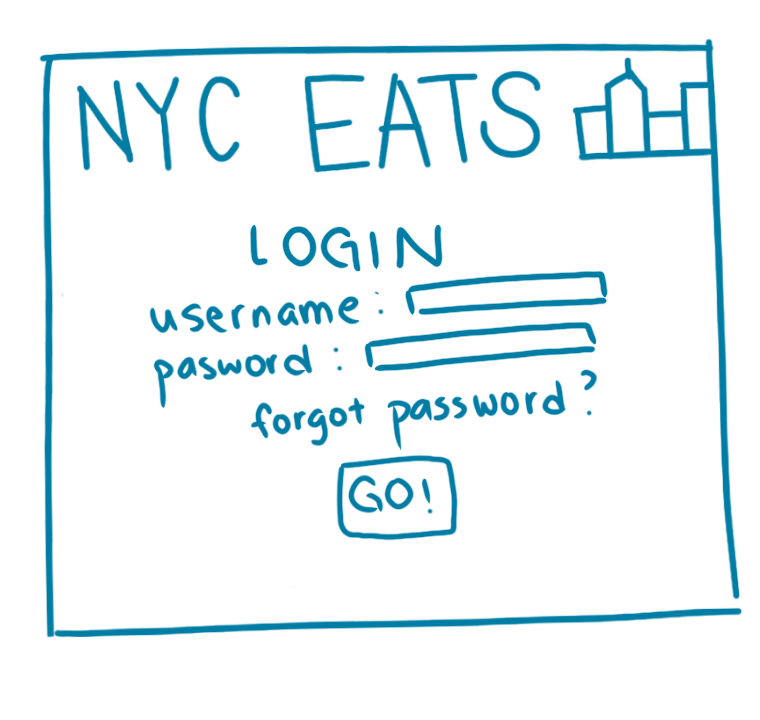

# :ramen: NYC Eats :shaved_ice:

## Overview

Basically, this is a simpler Yelp focused on the resturants in NYC. Users can rank their favorite resturants and search results can be filtered by cuisine, borough, and price point. The search results will be displayed by how many people ranked that resturant as their top 5. Users can register and login to post reviews with pictures and rank resturants. 

## Data Model

The application will store Users, Resturants and Reviews

* users can have multiple reviews (via references)
* reviews have content, timestamp, and images
* each resturant will have cuisine, borough, price point, popularity, and reviews (by embedding)


An Example User:

```javascript
{
  username: "foodie123",
  hash: // a password hash,
  reviews: // an array of references to Review documents
  
}
```
An Example Review:

```javascript
{
  username: "foodie123",
  verdict: "Great service, great food",
  rank: 2,
  createdAt: // timestamp
}
```

An Example Resturant with Embedded Items:

```javascript
{
  name: "Top Thai",
  cuisine: "Thai",
  borough: "Manhattan",
  price: "$$",
  popularity: 10,
  pictures: //images
  reviews: [
    { name: "foodie123", verdict: "Great service, great food", rank: 2},
    { name: "iloveramen", verdict: "Amazing lunch special: only 10 dollars!!!", rank: 5},
  ]
  
}
```


## [Link to Commented First Draft Schema](db.js) 

## Wireframes

/user - page for user, includes their id, password, and reviews sorted by date


/signup - page for user to sign up using id, password, and email


/login - page for userto login using id and password



/main - page for showing all resturants sorted by popularity and search bar for filtering


/resturant - page for showing specific resturant, including information about restuant, pictures, and reviews


## Site map


## User Stories or Use Cases

1. as non-registered user, I can register a new account with the site
2. as a user, I can log in to the site
3. as a user, I can write a review and upload pictures with my review
4. as a user, I can view all my reviews 
5. as a non-registered user and user, I can view and search for resturants


## Research Topics

* (5 points) Integrate user authentication
    * I'm going to be using passport for user authentication
    * And account has been made for testing; I'll email you the password
    * see <code>cs.nyu.edu/~jversoza/ait-final/register</code> for register page
    * see <code>cs.nyu.edu/~jversoza/ait-final/login</code> for login page
* (4 points) Perform client side form validation using a JavaScript library
    * see <code>cs.nyu.edu/~jversoza/ait-final/my-form</code>
    * if you put in a number that's greater than 5, an error message will appear in the dom


## [Link to Initial Main Project File](app.js) 

(___TODO__: create a skeleton Express application with a package.json, app.js, views folder, etc. ... and link to your initial app.js_)

## Annotations / References Used

1. [passport.js authentication docs](http://passportjs.org/docs) - (add link to source code that was based on this)

